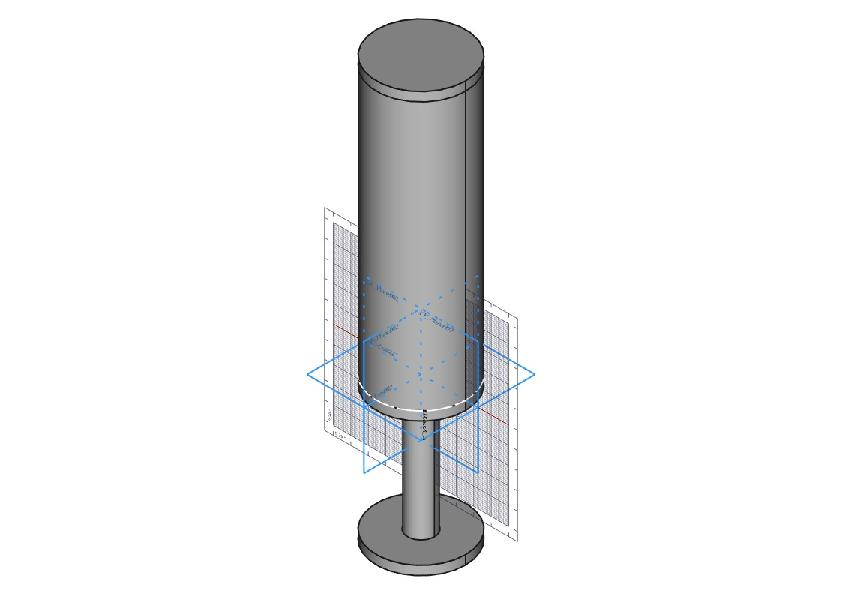
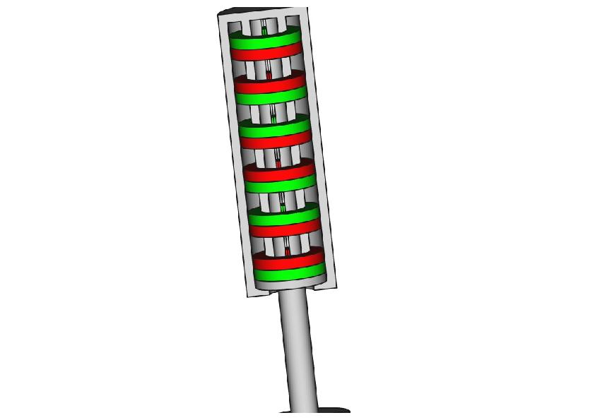
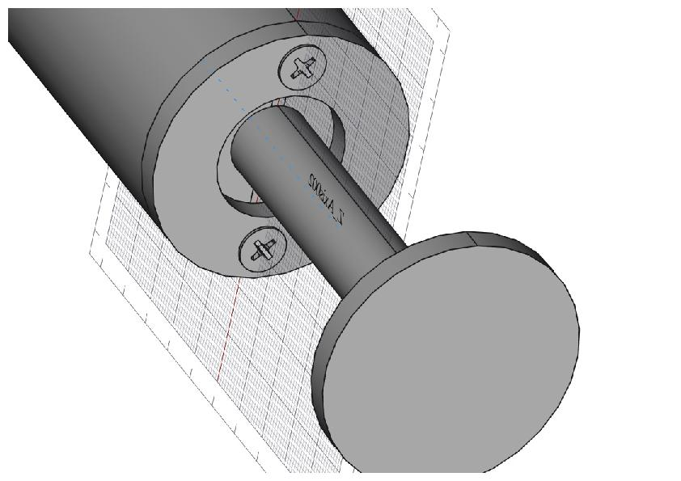
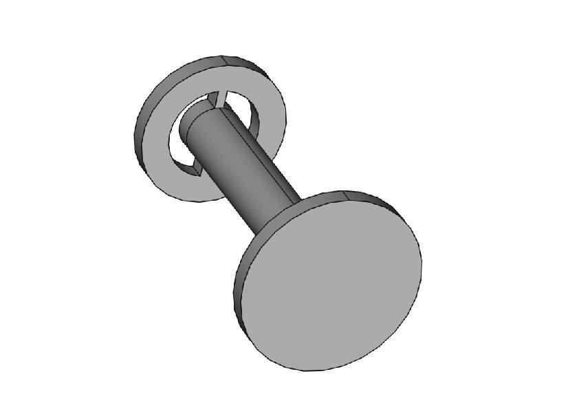
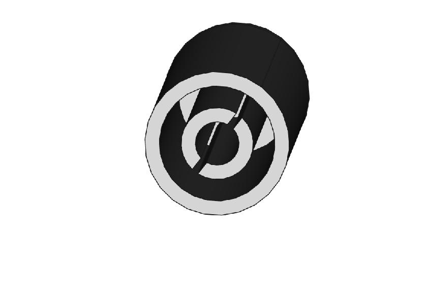

# Magnetic Spring
FreeCAD model of spring via magnets

The magnets as shown are not in static equilibrium if they have [magnetic moments](https://en.wikipedia.org/wiki/Magnetic_moment) of the same magnitude.

Thanks to FreeCAD, Wikipedia, [University Physics Volume 1](https://openstax.org/details/books/university-physics-volume-1), [University Physics Volume 2](https://openstax.org/details/books/university-physics-volume-2) ("Access for free at openstax.org."), etc.
